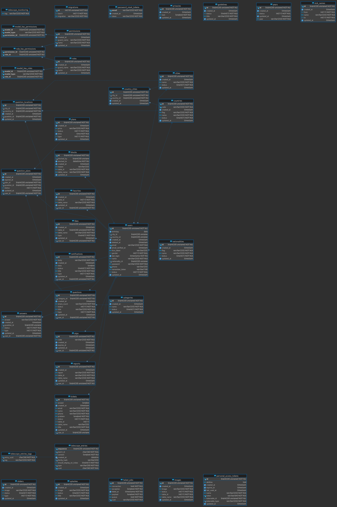

# AskMe - Laravel Project

<p align="center">
        
</p>

<p align="center">
    <a href="https://play.google.com/store/apps/details?id=com.asos.asalny">
        
    </a>
    <a href="#">
        
    </a>
</p>

## Table of Contents

- [Project Overview](#project-overview)
- [Tools Used](#tools-used)
- [Code Editor](#code-editor)
- [Project Idea](#project-idea)
- [Application Description](#application-description)
- [Developer Information](#developer-information)
- [Build Timeline](#build-timeline)
- [Getting Started](#getting-started)
- [Contact](#contact)
- [Database Schema](#database-schema)
- [File Structure](#file-structure)

## Project Overview

Welcome to AskMe, a Laravel-based application that allows users to ask questions and receive responses based on
real-world experiences. The application introduces a unique concept where users can get quick responses by subscribing
to a premium service. The project leverages various tools and technologies to create a seamless and interactive
platform.

## Tools Used

- **PHP**: ^8.1
- **Blade UI Kit/Blade Icons**: ^1.5
- **Blade UI Kit/Blade UI Kit**: ^0.4.0
- **Blade UI Kit/Blade Zondicons**: ^1.4
- **Guzzle HTTP**: ^7.2
- **Kreait/Laravel-Firebase**: ^5.4
- **Laravel Framework**: ^10.10
- **Laravel Sanctum**: ^3.3
- **Laravel Telescope**: ^4.16
- **Laravel Tinker**: ^2.8
- **Livewire**: ^3.0
- **Power Components/Livewire Powergrid**: ^5.1
- **Spatie/Laravel-Permission**: ^6.0

## Code Editor

- **PHPStorm**: [Download PHPStorm](https://www.jetbrains.com/phpstorm/)

## Project Idea

AskMe is a platform that allows users to post questions and receive answers from others in the same city. For users in a
hurry, a subscription model is available, allowing them to pay a fee for quicker responses. The application includes
features for selecting a city, categorizing questions, adding images, and two options for posting questions: instant
post or subscription-based post.

## Application Description

If you have a question or inquiry, you can enter the AskMe application, write your question, and people from the same
city will respond based on their experiences. If you need a quick response, you can pay a certain amount, for example,
$10, for a 5-hour priority subscription for your question. Users can post questions by choosing the city and category,
typing the question, and uploading images if needed. There are two options: choosing to subscribe for instant question
prioritization or posting a regular question.

## Developer Information

- **Developer**: Mahmoud Almalah
- **Contact**: +201026475912

## Build Timeline

- **API**: 2 days
- **Admin Panel**: 4 days

## Getting Started

1. **Clone the Repository**

    ```bash
    git clone https://github.com/*/*.git
    ```

2. **Install Dependencies**

    ```bash
    composer install
    ```

3. **Copy Environment File**

    ```bash
    cp .env.example .env
    ```

4. **Generate Application Key**

    ```bash
    php artisan key:generate
    ```

5. **Configure Database**

   Update the database configuration in the `.env` file with your database credentials.

6. **Run Migrations and Seed Database**

    ```bash
    php artisan migrate --seed
    ```

7. **Start the Development Server**

    ```bash
    php artisan serve
    ```

   Access the application at [http://127.0.0.1:8000](http://127.0.0.1:8000).

## Contact

For inquiries or support, please contact Mahmoud Almalah at +201026475912.

Thank you for choosing AskMe! Happy coding!

## Database Schema



## File Structure

```bash
.
├── app
│   ├── Enum
│   │   ├── AnswerStatus.php
│   │   ├── QuestionStatus.php
│   │   └── Assets.php
│   │   └── NotificationState.php
│   │   └── PaymentState.php
│   │   └── UserState.php
│   ├── Helpers
│   │   ├── Helper.php
│   ├── Http
│   │   ├── Controllers
│   │   │   ├── API
│   │   │   │   ├──V1
│   │   │   │   │   ├── Auth
│   │   │   │   │   │   ├── AuthenticationController.php
│   │   │   │   │   ├── Question
│   │   │   │   │   │   ├── QuestionController.php
│   │   │   │   │   ├── Answers
│   │   │   │   │   │   ├── AnswerController.php
│   │   │   │   │   ├── Notification
│   │   │   │   │   │   ├── NotificationController.php
│   │   │   │   │   ├── Plans
│   │   │   │   │   │   ├── PlanController.php
│   │   │   │   │   ├── Actions
│   │   │   │   │   │   ├── ActionController.php
│   │   │   │   │   ├── QuestionPlan
│   │   │   │   │   │   ├── QuestionPlanController.php
│   │   │   │   │   ├── Endpoints
│   │   │   │   │   │   ├── EndpointController.php
│   │   │   │   │   ├── User
│   │   │   │   │   │   ├── UserController.php
│   │   │   ├── WEB
│   │   │   │   ├── Admin 
│   │   │   │   │   ├── Auth
│   │   │   │   │   │   ├── AuthenticationController.php
│   │   │   │   │   ├── Blocks
│   │   │   │   │   │   ├── BlockController.php
│   │   │   │   │   ├── Country
│   │   │   │   │   │   ├── CountryController.php
│   │   │   │   │   ├── Home
│   │   │   │   │   │   ├── HomeController.php
│   │   │   │   │   ├── Questions
│   │   │   │   │   │   ├── QuestionController.php
│   │   │   │   │   ├── Roles
│   │   │   │   │   │   ├── RoleController.php
│   │   │   │   │   ├── Users
│   │   │   │   │   │   ├── UserController.php
│   │   │   │   │   ├── Years
│   │   │   │   │   │   ├── YearController.php
│   │   │   │   |── User
│   │   │   │   │   ├── Share
│   │   │   │   │   │   ├── ShareController.php
│   │   ├── Controllers
│   │   │   ├── Controller.php
│   │   ├── Middleware
│   │   │   ├── AdminMiddleware.php
│   │   │   ├── AuthGardMiddleware.php
│   │   │   ├── TrustCodeMiddleware.php
│   │   ├── Requests
│   │   │   ├── API
│   │   │   │   ├── V1
│   │   │   │   │   ├── Auth
│   │   │   │   │   │   ├── ForgotPasswordRequest.php
│   │   │   │   │   │   ├── LoginRequest.php
│   │   │   │   │   │   ├── RegisterRequest.php
│   │   │   │   │   │   ├── ResetPasswordRequest.php
│   │   │   │   │   ├── Question
│   │   │   │   │   │   ├── QuestionRequest.php
│   │   │   │   │   ├── Answers
│   │   │   │   │   │   ├── AnswerRequest.php
│   │   │   │   │   ├── Profile
│   │   │   │   │   │   ├── ProfileRequest.php
│   │   │   │   │   ├── QuestionPlan
│   │   │   │   │   │   ├── QuestionPlanRequest.php
│   │   │   ├── API 
│   │   │   │   ├── Request.php
│   │   ├── Resources
│   │   │   ├── API
│   │   │   │   ├── V1
│   │   │   │   │   ├── Answer
│   │   │   │   │   │   ├── AnswerResource.php
│   │   │   │   │   ├── Auth
│   │   │   │   │   │   ├── AuthResource.php
│   │   │   │   │   ├── Block
│   │   │   │   │   │   ├── BlockResource.php
│   │   │   │   │   ├── Endpoints
│   │   │   │   │   │   ├── EndpointResource.php
│   │   │   │   │   ├── Home
│   │   │   │   │   │   ├── HomeResource.php
│   │   │   │   │   ├── Notification
│   │   │   │   │   │   ├── NotificationResource.php
│   │   │   │   │   ├── Plans
│   │   │   │   │   │   ├── PlanResource.php
│   │   │   │   │   ├── Privacy
│   │   │   │   │   │   ├── PrivacyResource.php
│   │   │   │   │   ├── QuestionPlan
│   │   │   │   │   │   ├── QuestionPlanResource.php
│   │   │   │   │   ├── Questions
│   │   │   │   │   │   ├── QuestionResource.php
│   │   │   │   │   ├── Ticket
│   │   │   │   │   │   ├── TicketResource.php
│   ├── Models
│   │   ├── Answer.php
│   │   ├── Block.php
│   │   ├── Category.php
│   │   ├── City.php
│   │   ├── Country.php
│   │   ├── CountryCity.php
│   │   ├── Favorite.php
│   │   ├── Guidelines.php
│   │   ├── Image.php
│   │   ├── Like.php
│   │   ├── Nationality.php
│   │   ├── NickName.php
│   │   ├── Notifications.php
│   │   ├── Otp.php
│   │   ├── Plans.php
│   │   ├── Privacy.php
│   │   ├── Question.php
│   │   ├── QuestionLocation.php
│   │   ├── QuestionPlan.php
│   │   ├── Report.php
│   │   ├── Slider.php
│   │   ├── Splash.php
│   │   ├── Ticket.php
│   │   ├── User.php
│   │   ├── Year.php
│   ├── Observers
│   │   ├── AnswerObserver.php
│   │   ├── CategoryObserver.php
│   │   ├── CityObserver.php
│   │   ├── CountryCityObserver.php
│   │   ├── CountryObserver.php
│   │   ├── GuidelinesObserver.php
│   │   ├── ImageObserver.php
│   │   ├── NationalitiesObserver.php
│   │   ├── QuestionObserver.php
│   │   ├── ReportObserver.php
│   │   ├── SliderObserver.php
│   │   ├── SplashObserver.php
│   │   ├── YearObserver.php
│   ├── Traits
│   │   ├── API
│   │   │   ├── V1
│   │   │   │   ├── FileManage.php
│   │   │   │   ├── ModelHelper.php
│   │   │   │   ├── Response.php
│   │   │   │   ├── UserHelper.php
│   │   ├── WEB
│   │   │   ├── V1
│   │   │   │   ├── Alert.php
│   │   │   │   ├── FirebaseMessaging.php
│   ├── Livewire
│   │   ├──All Models CRUD Livewire Components
.
